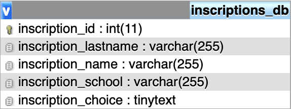

# Algorithme-de-repartition
Il s'agit d'une page web qui permet à des étudiants de faire une liste de voeux et un algorithme pour les répartir suivant une contrainte.

Le code est entièrement commenté pour en comprendre son fonctionnement.

# Utilisation

## index.php 

Chaque étudiant entre son nom, prénom et son école puis séléctionne 5 projets dans l'ordre qu'il souhaite. Le projet 1 est le choix de plus grande priorité, le choix 5 de plus faible priorité. Ensuite, il clique sur envoyer pour enregistrer ses données dans la BDD. 
Un décompte en haut de la page permet de savoir le nombre d'étudiant inscrits. De plus, un compte à rebours peut être regler pour imposer une date de fin (mais une fois la date expirer, les votes ne sont pas coupé).

Les informations entrées par chaque candidat se retrouvent dans une BDD, une seule table suffit et prend cette forme :




## algorithme.php 

Une fois les votes finis, il faut aller sur la page http://nomdedomaine.com/algorithme.php. Cela permet de lancer l'algorithme et d'afficher les résultats, de plus un fichier sous format CSV est généré et téléchargeable via un bouton.


# Adaptation index.php

Pour le réutiliser, il faut l'adapter aux nouvelles conditions. 
Dans un premier temps, il faut changer les fiches projets. Dans index.php, chaque fiche projet est codée sous cette forme:

```
<div class="card mb-3" id="p2" style="width: 18rem;" onclick="select(this)">
  <div class=""><h1></h1></div>
  
  <div class="card-body">
    <h5 class="card-title">PX -TITRE</h5>
    <p class="card-text">DESCRIPTION</p>
  </div>
</div>
```

Il faut donc adapter la source de l'image, qu'il faut préalablement uploader dans le dossier media.
Ensuite, il faut changer le numéro du projet ainsi que le titre du projet et enfin sa description.

Finalement, on peut modifier la date de fin du décompte via la variable :
```
var countDownDate = new Date("Mar 5, 2021 10:00:00").getTime(); //date de fin du compte à rebours
```

# Adaptation algorithme.php

Dans ce fichier, il y a plusieurs paramètres à modifier pour le fonctionnement de l'algorithme, ils se situent en haut du fichier.
```
$nb_de_choix = 22;  //code le nombre de projets
$nb_max_par_projet = 4;  //code le nombre max d'étudiants par projets
```

# Adaptation variables.php

Dans ce fichier, il y a plusieurs paramètres à modifier pour pouvoir se connecter à la BDD, ils se situent en haut du fichier.
```
$database['hote'] = '*********';    //Adresse de l'hebergeur de la BDD
$database['user'] = '*********';    //Nom d'utilisateur
$database['base'] = '*********';    //Nom de la base
$database['pass'] = '*********';    //Mot de passe
```
Il est nécessaire de les modifier pour que les inscriptions soient prisent en compte. De plus, l'algorithme récupère toutes ces infos provenant de la BDD.
Il faut aussi recréer la table illustrer en haut du README. Pour cela il suffit d'importer sur le portail phpmyadmin de votre BDD le fichier bdd.sql
